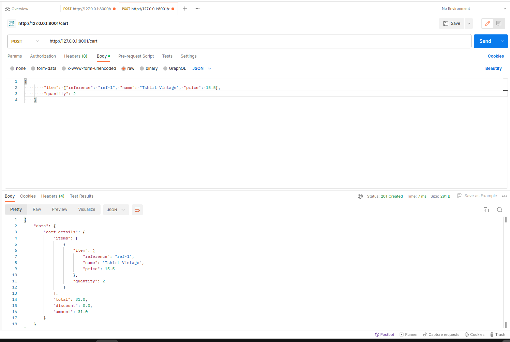
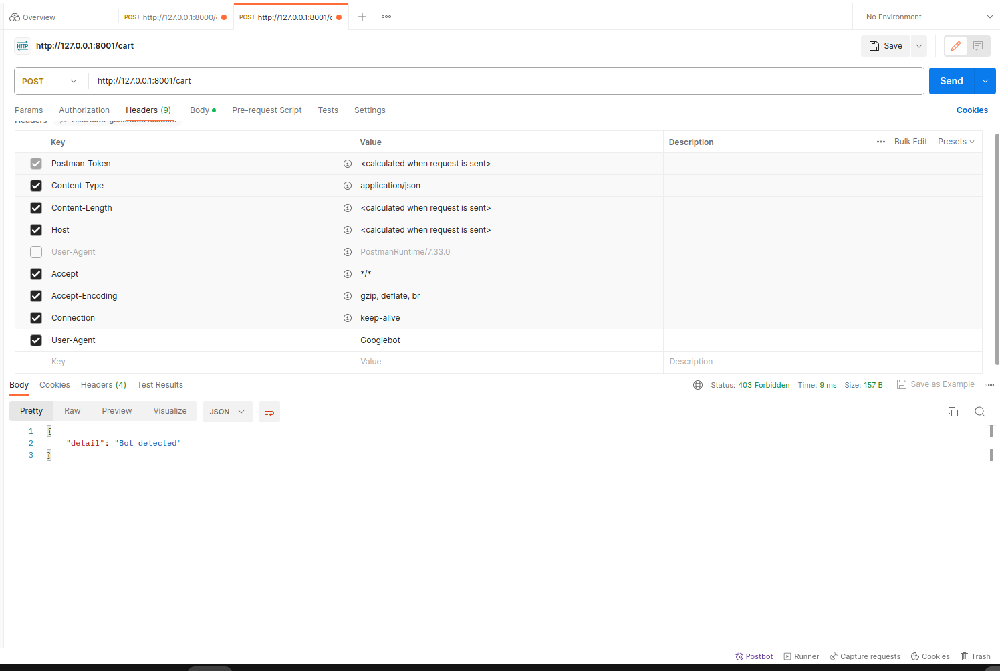

## CART API

Webservice in charge of cart management base of FastAPI , Poetry and Docker

### DEPENDENCIES
  
  - [Python](https://www.python.org/downloads/) 
  - [Poetry](https://python-poetry.org/) 
  - [FastAPI](https://fastapi.tiangolo.com/)
  - [Docker](https://www.docker.com/)

### GETTINGS STARTED

  1 - Install dependencies using Poetry
  ` poetry install `

  2 - Build your docker image 

  > Before that navigate to your /protection_api directory
  and follow instructions there to start the protection_api

   `  docker build -t datadome-cart-api-image . `

  3 - Start your webservice
  
  `  docker run -p 8001:8001 datadome-cart-api-image `

Once thoses step done, all your webservice will run 

- Cart API homepage available here -> http://localhost:8001
- API Documentation avalaible here -> http://localhost:8001/docs

### TESTING

Add item using postman with success

---

Add Item with User-Agent : Googlebot

---
